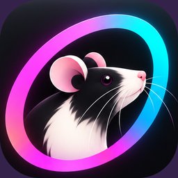
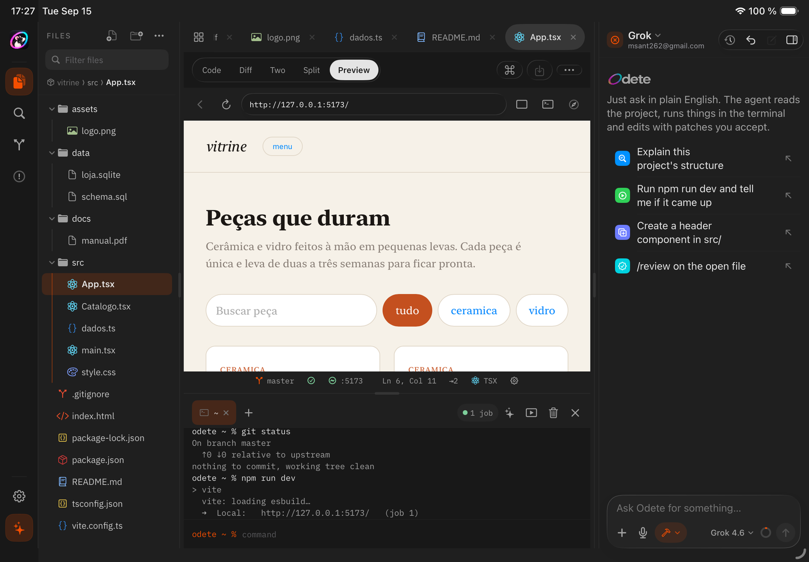
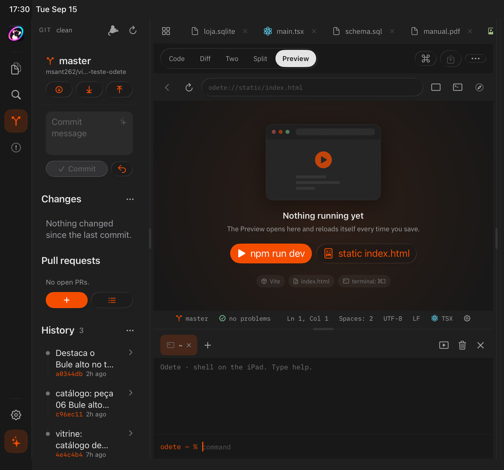
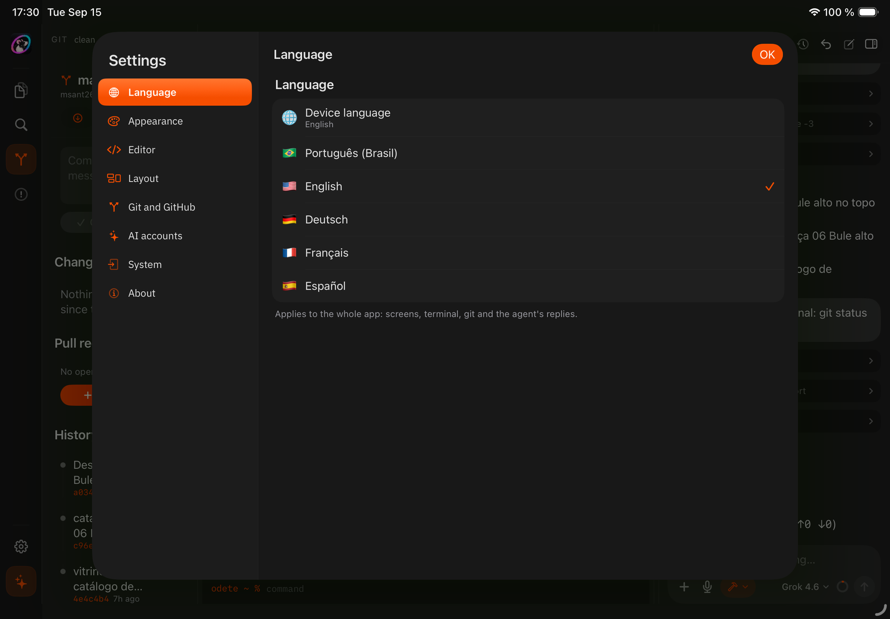
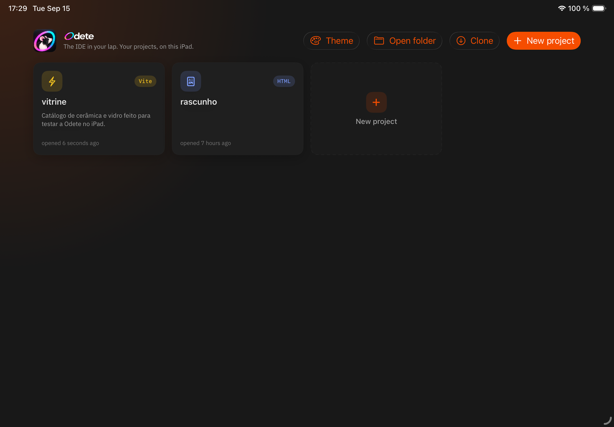

<div align="center">



# Odete

**Un vrai IDE qui tourne entièrement sur un iPad.**
Éditeur, git, terminal, npm, aperçu en direct et un agent de code — pas de Mac, pas de serveur, pas de machine distante.

[](#prérequis)
[](#architecture)
[](#architecture)
[](#comment-ça-tourne-vraiment)
[](#parler-cinq-langues)
[](#contribuer)
[](CHANGELOG.md)

[English](README.md) · [Português](README.pt-BR.md) · [Deutsch](README.de.md) · **Français** · [Español](README.es.md)

</div>

---

> **TL;DR** — Odete est un IDE SwiftUI natif pour iPadOS 26. Il a un vrai dépôt git par
> projet (libgit2), un shell qui exécute vraiment `npm install` et `npm run dev`, un runtime
> compatible Node sur JavaScriptCore, esbuild compilé en WebAssembly, et un agent IA qui lit tes
> fichiers, lance des commandes et propose des patchs que tu acceptes hunk par hunk. Rien n’est
> compilé dans le cloud. Rien n’est envoyé. Referme le capot — il n’y a pas de capot.

> **Nouveautés de la 1.5** — plus de plafond de sortie sur les modèles cloud et des paramètres
> découverts par modèle (les nouvelles versions marchent dès le jour un), compaction de la
> conversation à 80 % de la fenêtre de contexte, historique local pour chaque fichier, un git qui
> ne signale plus un push rejeté comme « ok », Tailwind CSS v4 dans les règles, `npm run dev` qui
> installe ce qui manque, et Next.js et Astro de bout en bout.
> [Changelog complet →](CHANGELOG.md)

<div align="center">
  
  <br />
  <sub>Un projet React + Vite : le code, le serveur de dev et la page en direct — le tout sur l’iPad.</sub>
</div>

---

## Pourquoi ça existe

Un iPad est un ordinateur rapide avec une histoire de développement catastrophique. Les réponses
habituelles sont une VM distante, un IDE web, ou un Mac dans la pièce d’à côté. Les trois veulent
dire : pas d’avion, pas de métro, pas de réseau, pas de boulot.

Odete prend l’autre route. Tout ce qui doit tourner tourne ici.

<table>
<tr>
<td width="50%" valign="top">

<h3>✅ Ce qu’il fait</h3>

- Édite du code avec la coloration tree-sitter et une vraie autocomplétion
- Clone, commit, branche, merge, push — du vrai git
- Lance `npm install` sur le vrai registre
- Lance `npm run dev` et sert ton app sur `127.0.0.1`
- Affiche l’app qui tourne dans un panneau Preview avec rechargement à chaud
- Fait tourner un agent IA avec outils, patchs, checkpoints et compaction automatique
- Garde un historique local de chaque fichier, pour qu’aucune version ne soit jamais perdue
- Fait tourner des projets Tailwind CSS v4, Next.js et Astro tels quels
- Parle 5 langues, des écrans à la sortie du terminal

</td>
<td width="50%" valign="top">

<h3>❌ Ce qu’il ne fait pas</h3>

- Pas de compilateur Swift (Apple n’en fournit pas pour iOS)
- Pas de SSH pour git — les remotes `git@host:` passent par HTTPS avec le compte de l’hôte
- Pas de binaires natifs (`esbuild`, `swc`, `lightningcss`) —
  Odete y substitue ses propres équivalents
- Pas encore d’`astro build` / `next build` — mode dev uniquement
- Pas de sous-modules, de cherry-pick ni de rebase interactif
- Pas de compte requis, et pas de télémétrie non plus

</td>
</tr>
</table>

---

## Les cinq panneaux

<table>
<tr>
<td width="50%" valign="top">

<h3>📝 Éditeur</h3>

Runestone avec tree-sitter. Marques git dans la gouttière (vert, bleu, rouge — touches-en une pour
ouvrir le hunk avec **Abandonner**), les symboles du fichier à un `@` dans la palette de commandes, un lint léger par
langage plus les vraies erreurs de syntaxe d’esbuild, et de la complétion à partir des mots du
fichier, des chemins du projet et des snippets.

Onglets, vue scindée, vue diff, visionneuses image/PDF/SQLite. Les buffers non enregistrés
survivent à un redémarrage. Si un fichier change sur le disque alors que son onglet a des modifications non
enregistrées, l’éditeur affiche une barre de conflit (garder le mien, recharger, voir le diff) au lieu d’écraser
l’un des deux côtés. Les fichiers CRLF restent CRLF, Tab/⇧Tab indentent une sélection, et `.editorconfig` est
respecté.

**Historique local** : avant toute écriture — ton enregistrement, l’agent, git, le terminal, Tout remplacer, une
suppression — la version précédente est conservée sur l’appareil (hors du projet et d’iCloud). Touche et maintiens
un onglet ou un fichier pour parcourir, comparer et restaurer ; les fichiers supprimés peuvent aussi revenir.

</td>
<td width="50%" valign="top">

<h3>🌿 Git</h3>

libgit2, pas un wrapper. Status, stage par fichier ou par hunk, commit, branch, merge avec
résolution de conflits, stash, remotes en HTTPS, blame et historique par fichier.

Les pull requests GitHub vivent dans le panneau : ouvres-en une, lis le Markdown, vérifie la CI,
commente, merge. ✨ écrit le message de commit à partir du diff stagé.

Il ne ment pas et ne perd pas de travail : un push rejeté par le serveur est signalé comme rejeté, **Commit**
et **Commit & push** sont séparés, abandonner demande d’abord confirmation et envoie les fichiers dans la corbeille
du projet avec un Annuler, et interrompre un merge ne touche qu’aux fichiers du merge.

</td>
</tr>
<tr>
<td valign="top">

<h3>⌨️ Terminal</h3>

Le shell maison d’Odete — pipes, redirections, `&&`, `||`, `;`, `&`, `$VAR`, contrôle des jobs,
historique et complétion avec Tab. `npm`, `node`, `git`, `npx`, plus les habituels
`ls`/`cat`/`grep`/`find`.

Tout ce qui ouvre un port devient un job (`jobs`, `kill %1`) et le Preview suit le dernier.
Le shell est confiné au dossier du projet — `rm -rf ../other` est refusé, pas exécuté.

</td>
<td valign="top">

<h3>▶️ Preview</h3>

Une WKWebView pointée sur ton serveur de dev, qui recharge à chaque enregistrement. Viewports
iPhone/iPad/bureau, la console de la page, et une touche pour l’ouvrir dans Safari.

Sans serveur qui tourne, `index.html` est servi directement depuis le disque via `odete://static/`.

</td>
</tr>
<tr>
<td colspan="2" valign="top">

<h3>✨ Agent</h3>

Apporte ton propre compte — Claude (OAuth abonnement), Codex et Grok (code d’appareil), ou
n’importe quel endpoint compatible OpenAI/Anthropic par clé et URL de base. Les tokens vivent dans
le Keychain, jamais dans un fichier.

Huit outils agissent sur le vrai projet : lire, écrire, remplacer, lister, grep, lire le terminal,
lancer une commande shell, et parler à l’API GitHub. Trois modes — **Chat** lit, **Plan** n’écrit
que `.odete/plan.md`, **Build** modifie. Trois niveaux de permission — **Ask**, **Auto**, **Full** —
et tout ce qui écrit dans le dépôt de quelqu’un d’autre demande à chaque fois, même en Full.

Chaque modification arrive sous forme de patch que tu acceptes, refuses, ou acceptes hunk par hunk.
Un checkpoint est écrit avant chaque tour, donc « annuler le dernier tour » tient en une touche.

Les modèles cloud n’ont aucun plafond de sortie artificiel : fenêtre de contexte, limite de sortie, raisonnement
et niveaux d’effort sont découverts par modèle (API des fournisseurs plus le catalogue public models.dev), si bien
qu’un modèle sorti hier marche déjà aujourd’hui. Quand une conversation dépasse **80 % de la fenêtre de contexte du
modèle**, elle est compactée comme le fait opencode — les anciennes sorties d’outils sont élaguées en premier, puis
le début est résumé et le tour continue. `/compact` le fait à la demande.

</td>
</tr>
</table>

<div align="center">
  
  <br />
  <sub>Le panneau Git. Les pull requests se lisent, se relisent et se mergent sans quitter l’app.</sub>
</div>

---

## Comment ça tourne vraiment

C’est la partie que les gens ne croient pas, alors voici le mécanisme honnête :

| Élément | Comment | Limite |
|---|---|---|
| **Node** | JavaScriptCore + une couche Node écrite à la main : `fs`, `path`, `events`, `buffer`, `stream`, `timers`, `crypto`, `fetch`, `http`, `require`/`import()` | Pas V8 (un shim de stack trace garde express & co. contents). Pas d’addons natifs, pas encore de Web Streams. |
| **npm** | Vrai registre, vraie résolution semver, `package.json` et `package-lock.json` identiques octet pour octet à ceux de npm, alias `npm:`, peers, dépendances GitHub/tarball/`file:`/workspaces | Les binaires natifs et les scripts d’installation sont ignorés |
| **Bundler** | `esbuild-wasm` qui tourne dans JavaScriptCore, résolution par condition navigateur, alias `@/`, CSS Modules, Sass/Less | Transformation et serveur de dev ; `build` pour Vite uniquement |
| **Tailwind** | Le compilateur `tailwindcss` v4 qui tourne dans le même moteur, avec un scanner de classes en JS à la place d’oxide | Pas de préfixage lightningcss |
| **Serveur HTTP** | Network.framework, lié à `127.0.0.1` | Local à l’appareil, par choix |
| **git** | libgit2 1.9.7 en XCFramework, SecureTransport, pas de SSH | HTTPS + token |
| **Preview Swift** | Un interpréteur pour un sous-ensemble de SwiftUI, rendu en vrai SwiftUI | Pas de compilateur — voir [Swift sur iPad](#swift-sur-ipad) |

Serveurs de dev qui marchent aujourd’hui : **Vite** (`dev`, `build`, `preview`), **Astro** (`dev`, avec les
content collections et le MDX), **Next** (`dev`, App Router avec CSS et Tailwind), **Nest** (via `node`).
`npm run dev` installe d’abord les dépendances manquantes, et le premier démarrage après une installation prend
environ 0,2 s parce que le serveur de dev est préchauffé en arrière-plan.

---

## Swift sur iPad

Il n’y a pas de compilateur Swift sur iOS, et Odete ne fait pas semblant du contraire.

Ce qu’il fait à la place : le Preview **interprète** un sous-ensemble utile de SwiftUI et le rend en
vrai SwiftUI — stacks, `List`/`Form`/`Section`, `ScrollView`, `NavigationStack`/`Link`, `Text`,
`Button`, `Toggle`, `TextField`, `Slider`, `Stepper`, `Image(systemName:)`, `Label`, `ForEach`,
`if`/`else`, `@State`/`@Binding`, les fonctions, l’interpolation de chaînes et les modificateurs
courants. L’état survit à un enregistrement ; « reset » repart de zéro. Tout ce qui sort du
sous-ensemble devient un placeholder en pointillés plus un avertissement dans Problèmes, avec le
numéro de ligne.

Pour du code qui doit vraiment compiler, le modèle **Swift Playground** produit un paquet
`.swiftpm` et un bouton le passe à Swift Playgrounds.

---

## Parler cinq langues

<div align="center">
  
</div>

Toute l’app — écrans, sortie du terminal, messages git, avertissements du lint, et la langue dans
laquelle l’agent répond — est traduite en **🇧🇷 Português · 🇺🇸 English · 🇩🇪 Deutsch · 🇫🇷 Français · 🇪🇸 Español**.

Par défaut, Odete suit l’iPad. Change-la dans **Réglages → Langue** et l’interface bascule
immédiatement, sans rouvrir l’app. Les dates, les tailles de fichiers, les temps relatifs et la
reconnaissance vocale suivent le même choix.

1 278 chaînes vivent dans un seul String Catalog. `make i18n` le compare au code source et échoue si
une phrase a été ajoutée sans traductions — c’est comme ça que ça le reste.

---

## Démarrer

### Prérequis

- Xcode 26.6 ou plus récent, avec le runtime du simulateur iOS 26.5
- `brew install xcodegen swiftformat swiftlint`

### Compiler et lancer

```bash
git clone https://github.com/OkamiOps/odete-ide.git
cd odete-ide
make run
```

`make run` génère le projet Xcode, le compile, l’installe sur le simulateur iPad Air 11 pouces (M4)
et le lance. Pour un autre appareil :

```bash
make run SIM="iPhone 17"
```

### Toutes les commandes

| Commande | Ce qu’elle fait |
|---|---|
| `make gen` | Génère `Odete.xcodeproj` à partir de `project.yml` |
| `make build` | Compile pour le simulateur |
| `make run` | Compile, installe et lance |
| `make unit` | Tests unitaires des 15 paquets (1 130 tests) |
| `make test` | Tests d’interface (XCUITest) |
| `make lint` | `swiftformat --lint` + `swiftlint` |
| `make format` | `swiftformat` |
| `make i18n` | Vérifie le catalogue de traductions par rapport au code source |
| `make check` | Tout ce que la CI lance, d’un coup |

---

## Architecture

Quinze paquets SwiftPM locaux, câblés par XcodeGen. Rien n’est récupéré sur le réseau au moment de
la compilation, sauf le XCFramework libgit2 épinglé, qui est embarqué dans le dépôt.

| Paquet | Responsabilité |
|---|---|
| `OdeteI18n` | Le String Catalog, la langue choisie, `tr()` et le formatage sensible à la locale |
| `OdeteCore` | Modèles purs, thèmes, règles d’exclusion, détection de langage, lint, état persisté |
| `OdeteFiles` | Les projets dans `Documents/Projects`, l’arborescence, les opérations, le watcher, la recherche, les modèles |
| `OdeteEditor` | `CodeEditorView` (Runestone + tree-sitter), thème de l’éditeur, barre clavier |
| `OdeteGit` | libgit2 : l’acteur `Repository`, diff/hunks, branches, merge, stash, remotes HTTPS |
| `OdeteAccounts` | Keychain, comptes par hôte, device flow GitHub et API REST |
| `OdeteRuntime` | JavaScriptCore avec la couche Node, du vrai HTTP sur `127.0.0.1` |
| `OdeteNpm` | Registre, semver, `package-lock` v3 identique à celui de npm, tarballs, `.bin`, alias, workspaces |
| `OdeteBundler` | esbuild-wasm dans JSC : transformation TS/ESM, build, serveur de dev avec rechargement |
| `OdeteShell` | Parseur (`\|` `>` `>>` `<` `&&` `\|\|` `;` `&` `$VAR`), builtins, git, npm, node, jobs |
| `OdetePreview` | La WKWebView du Preview, le schéma `odete://static/` et le pont vers la console |
| `OdeteAgent` | Providers, streaming, la boucle d’outils, patchs, checkpoints, conversations, skills |
| `OdeteSwift` | Parseur et interpréteur du sous-ensemble SwiftUI, rendu natif, empaquetage `.swiftpm` |
| `OdeteUI` | Design system : `Theme`, `Rail`, `PaneHeader`, `EditorTabs`, `Splitter`, `FileGlyph` |
| `OdeteApp` | Les écrans : hub, espace de travail, panneaux, feuilles, réglages |

Les dépendances vont dans un seul sens : `OdeteApp → {OdeteUI, OdeteGit, OdeteAccounts, OdeteShell, OdetePreview, OdeteAgent, OdeteSwift}`,
`OdeteShell → {OdeteGit, OdeteNpm, OdeteRuntime, OdeteBundler}`, `OdeteBundler → OdeteRuntime`,
tout par-dessus `OdeteCore` et `OdeteI18n`.

Les specs de conception et les plans d’implémentation des six phases vivent dans
[`docs/superpowers/`](docs/superpowers/).

---

## Où vivent tes données

| Quoi | Où |
|---|---|
| Projets | `Documents/Projects/<name>/` — visible dans l’app Fichiers |
| Métadonnées du projet | `<project>/.odete/project.json` |
| Conversations, patchs, checkpoints, plans | `<project>/.odete/` (exclu de git) |
| Disposition et préférences | `Application Support/Odete/state.json` |
| Historique local des fichiers | `Application Support/Odete/Historico/` — uniquement sur l’appareil, jamais synchronisé |
| Tokens et clés | Keychain — jamais un fichier, jamais une sauvegarde |

`.odete/` est ajouté à `.git/info/exclude`, donc l’historique de l’agent n’atterrit jamais dans tes
commits.

Les projets peuvent vivre dans iCloud Drive à la place (**Réglages → Système**), ce qui fait la
différence entre « désinstaller, c’est tout perdre » et « désinstaller, c’est ne rien perdre ».

---

## Le hub

<div align="center">
  
</div>

Les projets affichent leur stack détectée, la première ligne de leur README, et la dernière fois que
tu les as ouverts. **Ouvrir le dossier** adopte un dossier de n’importe où via un security bookmark
(marqué *externe*), **Cloner** récupère depuis une URL, **Nouveau projet** propose : vide,
Vite + React, Astro, HTML simple, vue SwiftUI, ou un paquet Swift Playground.

Les Raccourcis sont branchés aussi : *Ouvrir un projet*, *Lancer une commande*, *Demander à Odete*,
*Nouveau projet*.

---

## Ce qui manque

Dit franchement, parce qu’un README qui ne liste que les victoires est une brochure :

- `astro build` et `next build` ne tournent pas encore — Astro et Next sont en mode dev uniquement
- Les îlots Astro avec hydratation `client:*` et les loaders de collection personnalisés ne tournent pas encore
- Next exécute l’App Router (segments dynamiques, catch-all, groupes de routes, route handlers,
  `metadata`, `not-found`, `error`) et le Pages Router, hydrate les composants `'use client'`
  et exécute le middleware, `next/font` et les Server Actions. Il manque : `useActionState`
  affiche son état initial jusqu’à l’hydratation de l’îlot (`renderToString` ne reçoit pas le
  postback), l’envoi de fichier par une action de formulaire, `'use server'` écrit dans le
  composant plutôt qu’en tête de fichier, les routes parallèles (`@slot`), et la navigation
  côté client — un lien recharge la page
- Pas de SourceKit, donc pas d’autocomplétion Swift ; `GeometryReader` et `Canvas` ne sont pas dans le sous-ensemble de l’aperçu
- La complétion ne se navigue pas aux flèches — Tab/Entrée prend le premier élément, ou touche l’écran
- Deux agents en parallèle, MCP et la voix ne sont pas faits
- Un `for(;;){}` pur qui n’appelle jamais l’app ne peut pas être interrompu avec Ctrl+C
- iCloud Drive exige que l’app soit signée avec le conteneur `iCloud.com.okamiops.odete`
- Le device flow GitHub a besoin que `OdeteGitHubClientId` soit rempli ; en attendant, un token personnel
- Se connecter avec un **abonnement** Claude ou Codex utilise les clients OAuth de ces CLI,
  qu’Anthropic et OpenAI réservent à leurs propres apps. C’est ton choix à faire, pas le nôtre.

---

## Contribuer

`make check` est le portail : format, lint, catalogue de traductions, build, 1 130 tests. La CI lance
la même chose à chaque push.

Deux règles qui ne sont pas évidentes :

1. **Toute nouvelle chaîne visible par l’utilisateur passe par `tr("…")`**, écrite en portugais — le
   portugais *est* la clé. Ajoute ensuite les quatre traductions dans
   `Packages/OdeteI18n/Sources/OdeteI18n/Resources/Localizable.xcstrings`. `make i18n` te dira si tu
   as oublié.
2. **Ne traduis jamais une chaîne qui est comparée quelque part.** Si du code fait `text == "x"`,
   `"x"` est une sentinelle, pas un libellé.

---

## Crédits

| | |
|---|---|
| [IBM Plex](https://github.com/IBM/plex) | Sans et Mono — OFL |
| [Runestone](https://github.com/simonbs/Runestone) + [tree-sitter](https://tree-sitter.github.io) | Éditeur et coloration — MIT |
| [libgit2](https://libgit2.org) | Git — GPL2 avec exception de liaison |
| [esbuild](https://esbuild.github.io) | Bundling et transformation — MIT |

Odete porte le nom d’une petite souris. Elle est dans l’icône, et dans le coin du panneau Git.
